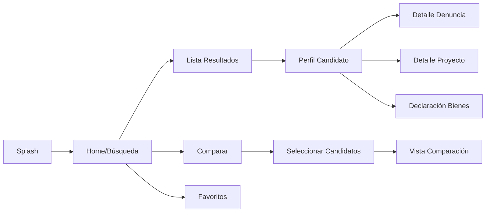

# CandidatoInfo - Transparencia Electoral Ciudadana 🗳️

## 📱 Descripción del Proyecto
CandidatoInfo es una aplicación móvil nativa para Android desarrollada en Kotlin que busca empoderar a los ciudadanos peruanos con información transparente y verificada sobre candidatos políticos. La app centraliza datos públicos de múltiples fuentes oficiales, permitiendo a los votantes tomar decisiones informadas basadas en hechos concretos sobre el historial, propuestas y antecedentes de los candidatos al Congreso y Presidencia del Perú.

### 🎯 Problema que resuelve
- La información sobre candidatos está dispersa en múltiples plataformas
- Dificultad para comparar candidatos de manera objetiva
- Falta de acceso rápido a antecedentes judiciales y declaraciones
- Desinformación durante períodos electorales

### 👥 Público objetivo
- Ciudadanos peruanos en edad de votar (18+ años)
- Personas interesadas en política y transparencia
- Votantes que buscan información verificada
- Organizaciones de sociedad civil

## 👨‍💻 Equipo de Desarrollo

| Nombre | Rol | Responsabilidades | GitHub |
|--------|-----|-------------------|---------|
| **Juan Aguirre** | Líder Técnico + Backend Developer | Arquitectura, Modelos, ViewModels, Repositorios | @JuanAguirre10 |
| **Samir Alfonso** | Diseñador UI/UX + Frontend Developer | Diseño Figma, UI Compose, Navegación, Temas | @Hazielcode |
| **Yair Araujo** | Documentador/QA + Feature Developer | Documentación, Testing, Features especiales | @yag-smith |

## 💡 Lluvia de Ideas Grupal - Información Clave para Transparencia Electoral

### 🤝 Ideas del Equipo
Durante nuestra reunión inicial, el equipo identificó la siguiente información como crucial para la transparencia electoral:

### 📊 Información Personal y Profesional
- **Juan propone**: Mostrar datos básicos verificables (DNI, edad, lugar de nacimiento) con indicador de verificación
- **Samir sugiere**: Foto oficial grande y clara en el perfil, con diseño tipo card profesional
- **Yair añade**: Incluir timeline visual de experiencia laboral y educación

### ⚖️ Transparencia y Antecedentes
- **Consenso grupal**: Priorizar denuncias penales con sistema de alertas visuales (🔴 graves, 🟡 menores)
- **Juan propone**: Integrar API del Poder Judicial para actualización automática de casos
- **Samir sugiere**: Diseñar cards expandibles para cada denuncia con estado actual
- **Yair añade**: Sistema de notificaciones cuando se actualice información legal de candidatos favoritos

### 🏛️ Historial Político
- **Ideas principales**:
  - Gráfico de asistencia al Congreso (visual tipo dona)
  - Timeline de cargos públicos anteriores
  - Contador de proyectos de ley (presentados vs aprobados)
  - Indicador de cambios de bancada con fechas

### 📋 Propuestas y Plan de Gobierno
- **Funcionalidad clave**: Comparador de propuestas por temas
- **Samir**: Diseño tipo tabs para navegar entre temas (economía, educación, salud)
- **Yair**: Checklist de propuestas cumplidas vs pendientes (para reelecciones)

### 🔍 Features Innovadoras (ideas del equipo)
1. **"Fact Check"**: Verificación de promesas anteriores
2. **"Alerta Roja"**: Notificación de nuevas denuncias
3. **"Compara Fácil"**: Comparación visual lado a lado
4. **"Transparencia Score"**: Puntuación basada en información disponible

## 🏗️ Arquitectura de la Información

### 📱 Estructura de Datos
```
CandidatoInfo/
├── Candidato/
│   ├── Información Personal
│   ├── Educación[]
│   ├── Experiencia Laboral[]
│   ├── Partido Político
│   └── Foto URL
├── Transparencia/
│   ├── Denuncias[]
│   │   ├── Tipo
│   │   ├── Estado
│   │   ├── Fecha
│   │   └── Detalle
│   ├── Declaración de Bienes[]
│   │   ├── Año
│   │   ├── Monto Total
│   │   └── Detalle
│   └── Deudas SUNAT
├── Historial Político/
│   ├── Cargos Anteriores[]
│   ├── Proyectos de Ley[]
│   ├── Votaciones[]
│   └── Asistencia %
└── Propuestas/
    ├── Ejes Temáticos[]
    ├── Plan de Gobierno URL
    └── Equipo Técnico[]
```

### 🔄 Flujo de Navegación



### 📲 Descripción de Pantallas

1. **Home/Búsqueda**
   - Barra de búsqueda principal
   - Filtros rápidos (Presidencial/Congreso)
   - Candidatos destacados
   - Acceso rápido a comparación

2. **Perfil del Candidato**
   - Header con foto y datos básicos
   - Tabs: General | Transparencia | Historial | Propuestas
   - Indicadores visuales (alertas por denuncias)
   - Botones de acción (comparar, compartir, favorito)

3. **Detalle de Documento/Denuncia**
   - Información completa del documento
   - Estado actual
   - Timeline de evolución
   - Link a fuente oficial
   - Opción de compartir

4. **Comparación** (Feature especial)
   - Tabla comparativa lado a lado
   - Métricas clave resaltadas
   - Diferencias marcadas visualmente

## 🛠️ Stack Tecnológico

### Desarrollo
- **Lenguaje**: Kotlin 100%
- **UI Framework**: Jetpack Compose
- **Arquitectura**: MVVM + Clean Architecture
- **Navegación**: Navigation Compose
- **Inyección de Dependencias**: Hilt
- **Base de Datos**: Room
- **Red**: Retrofit + Coroutines
- **Imágenes**: Coil

### Herramientas
- **IDE**: Android Studio Hedgehog
- **Diseño**: Figma
- **Control de Versiones**: Git + GitHub
- **CI/CD**: GitHub Actions (futuro)

## 🌳 Estrategia de Branching

### Estructura de Ramas
```
main (producción)
  └── develop (integración)
       ├── feature/ui-design (Samir)
       ├── feature/data-layer (Juan)
       └── feature/search-compare (Yair)
```

### Flujo de Trabajo Git
1. **Main**: Código estable, versiones release
2. **Develop**: Rama de integración para features
3. **Feature branches**: Una por funcionalidad

### Convención de Commits
```
tipo(alcance): descripción corta

Tipos: feat, fix, docs, style, refactor, test, chore
Ejemplo: feat(search): agregar filtro por partido político
```

### Proceso de Integración
1. Cada desarrollador trabaja en su feature branch
2. Pull Request a develop cuando esté listo
3. Code review por al menos 1 compañero
4. Merge a develop tras aprobación
5. Integración a main al final de cada día (si está estable)

## 📁 Estructura del Proyecto Kotlin

```
app/src/main/java/com/candidatoinfo/
├── di/                    # Hilt modules
├── data/
│   ├── local/            # Room, DataStore
│   ├── remote/           # Retrofit, APIs
│   ├── repository/       # Repository implementations
│   └── model/           # Data models
├── domain/
│   ├── model/           # Domain models
│   ├── repository/      # Repository interfaces
│   └── usecase/         # Use cases
├── presentation/
│   ├── ui/
│   │   ├── home/       # Samir
│   │   ├── detail/     # Samir
│   │   ├── compare/    # Yair
│   │   └── components/ # Shared
│   ├── viewmodel/      # Juan
│   ├── navigation/     # Samir
│   └── theme/         # Samir
└── utils/             # Yair

```

### Asignación por Paquetes
- **Juan**: `data/`, `domain/`, `viewmodel/`
- **Samir**: `ui/`, `navigation/`, `theme/`
- **Yair**: `utils/`, features en `ui/compare`, documentación

## 🔗 Enlaces del Proyecto

- **Prototipo Figma**: [Enlace pendiente - Samir]
- **Repositorio GitHub**: https://github.com/JuanAguirre10/CandidatoInfo
- **Documentación de APIs**: [Google Docs - Yair]

## ✅ Checklist Entregables Día 1

- [x] Roles definidos y documentados
- [x] Investigación de fuentes completada
- [x] Prototipo Figma (3 pantallas mínimo)
- [x] Repositorio GitHub creado
- [x] README.md completo
- [x] Estructura de branches definida
- [x] Flujo de navegación documentado
- [x] Arquitectura de información definida

